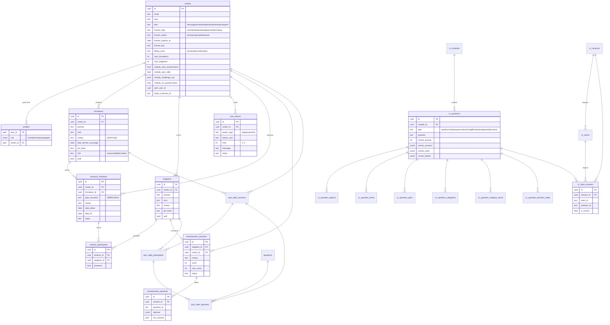
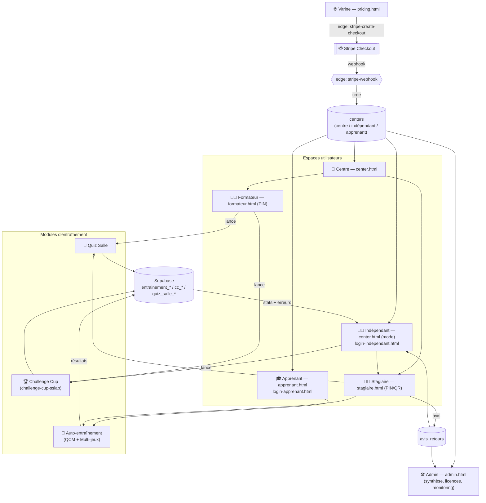
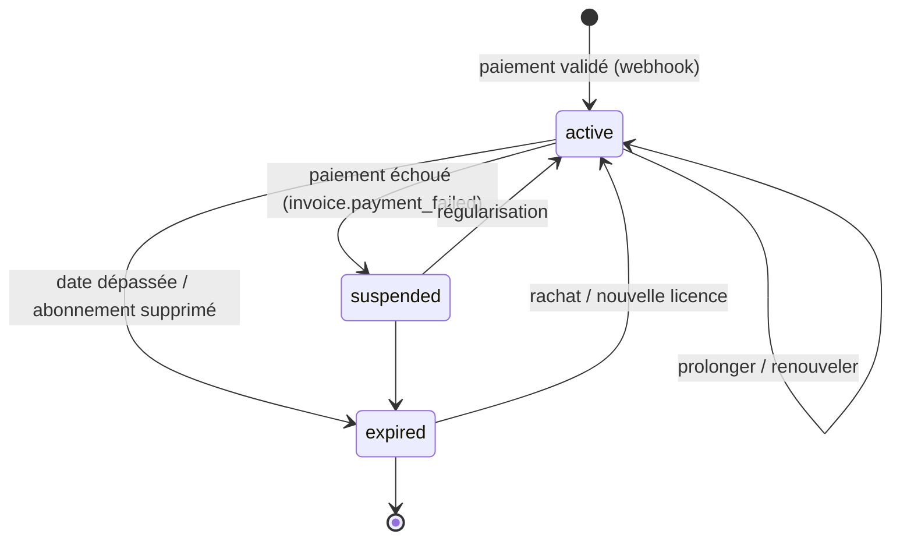
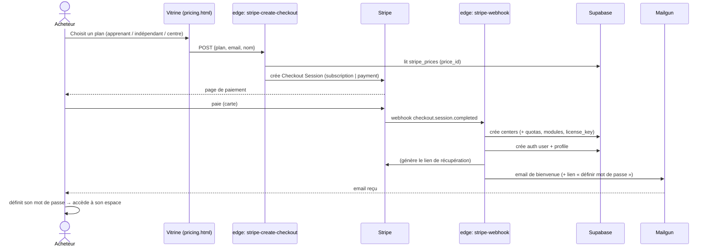
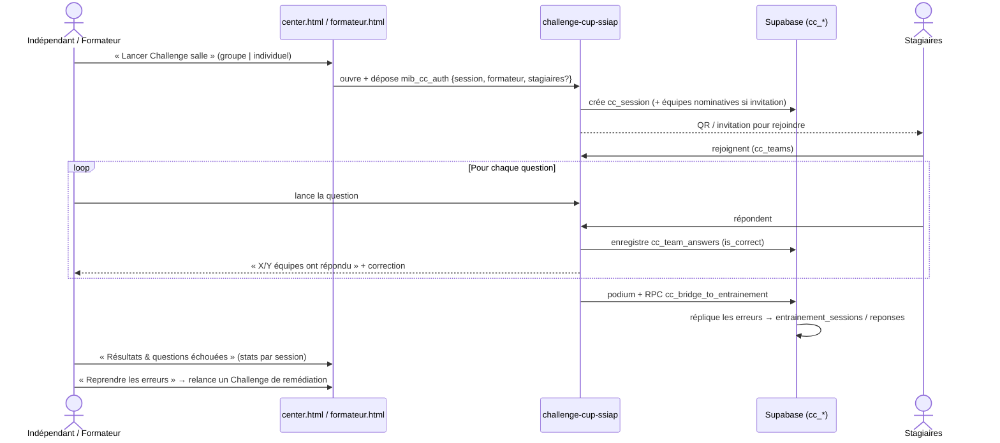

# MIBsoft SSIAP — Diagrammes UML

> Généré depuis le schéma réel de la base (clés étrangères). Les fichiers `.md` Mermaid se
> visualisent directement sur GitHub, dans VS Code (extension Mermaid) ou sur https://mermaid.live.

---

## 1. Diagramme de classes / entités (modèle de données)

---

## 2. Diagramme de composants (espaces & flux)

---

## 3. Cycle de vie d'une licence (états)

---

## 4. Diagramme de séquence — Achat & activation (Stripe)

---

## 5. Diagramme de séquence — Déroulé d'un Challenge Cup

